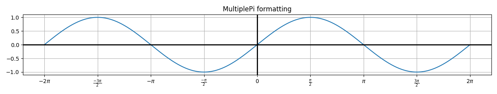
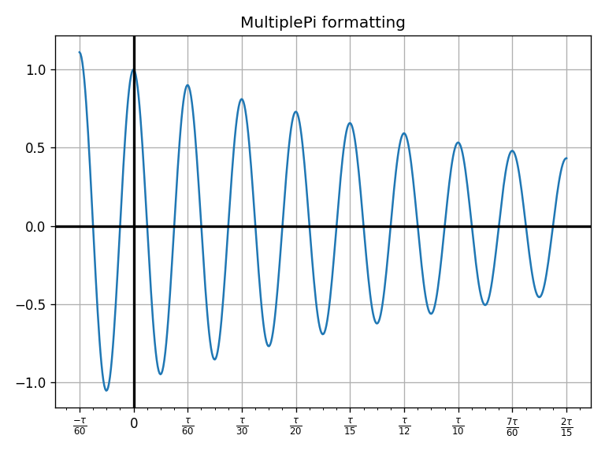

# Matplotlib Format Pi

Create locator and formatter instances to make x/y labels and ticks correspond to multiples of pi.

The `MultiplePi` class provides methods to seamlessly tell matplotlib to create and format tick labels as multiples of pi.

In addition, the `MultiplePi` class allows a user to change the denominator of pi.

Multiples of π/{2, 3, 4, ...} can be represented if needed.

## Examples

Simply, the instance can be asssigned a denominator of pi then passed to matplotlib.

The parameters can also be modified to adjust the output to something more sophisticated.

## Todo

1.  Raise error for improper usage (plugging in 1/4 for a multiple of 1/3)

## Meta

Inspired by [this](https://stackoverflow.com/questions/40642061/how-to-set-axis-ticks-in-multiples-of-pi-python-matplotlib) post on StackOverflow.
